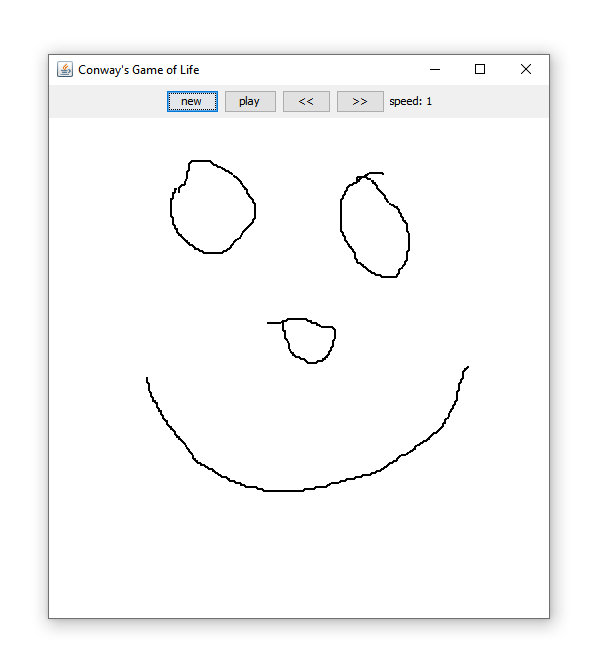
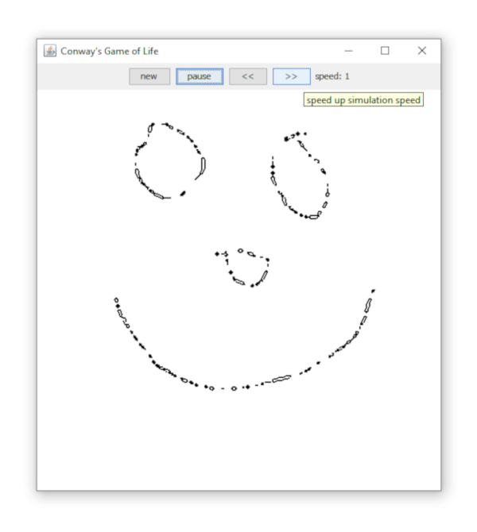
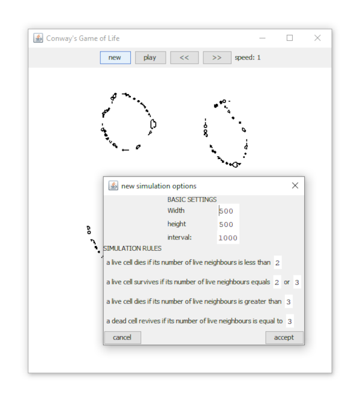
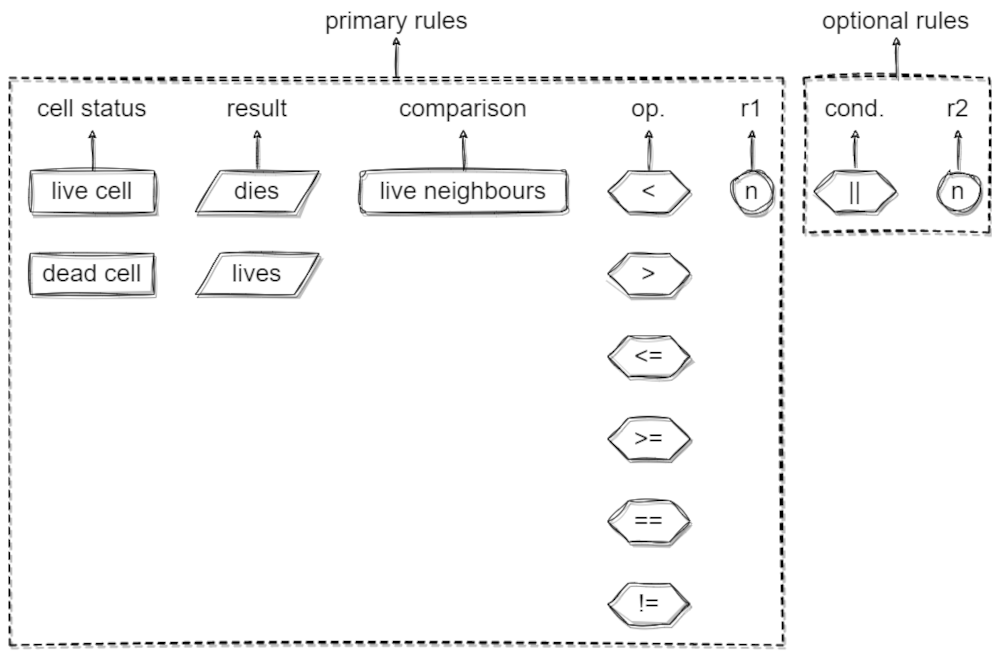

<html>
<body>
  
  

    <h1>Conway's Game of Life - with Java Swing</h1>
    <h2>Included in this repo:</h2>
    <ul>
      <li>
        [a] Conway's Game of Life Basic - a single-class immplementation which prints the simulation to console.
      </li>
      <li>
        [b] Conway's Game of Life GUI -  interactable 2D implementation using Swing API.
      </li>
      <li>
        100% java!
      </li>
    </ul>
  

  
  

    
  

    <h2>Features</h2>
    <ul>
      <li>
        [b] start new simulation with custom sim size and rules
      </li>
      <li>
        [b] draw live cells to the canvas directly using the mouse
      </li>
      <li>
        [b] play/pause/reset simulation
      </li>
      <li>
        [b] change simulation speed
      </li>
    </ul>
  

  
  

    <h2>Planned Features</h2>
    <ul dir="rtl">
      <li>
        [b] implement "info" panel to display current sim sim and rules
      </li>
       <li>
        [b] implement fully customisable rules
      </li>
    </ul>
  

  
  

    <h2>Current Issues</h2>
    <ul dir="rtl">
      <li>
        [a] none
      </li>
      <li>
        [b] none
      </li>
    </ul>
  

  

    
  <!--
    1 image per row = 90%
    2 image per row = 45%
    3 image per row = 30%
    4 image per row = 23%
   -->
  
  

    <h2>GUI</h2>
    </img>
    </img>
    </img>
    </img>
  

</body>
</html>
